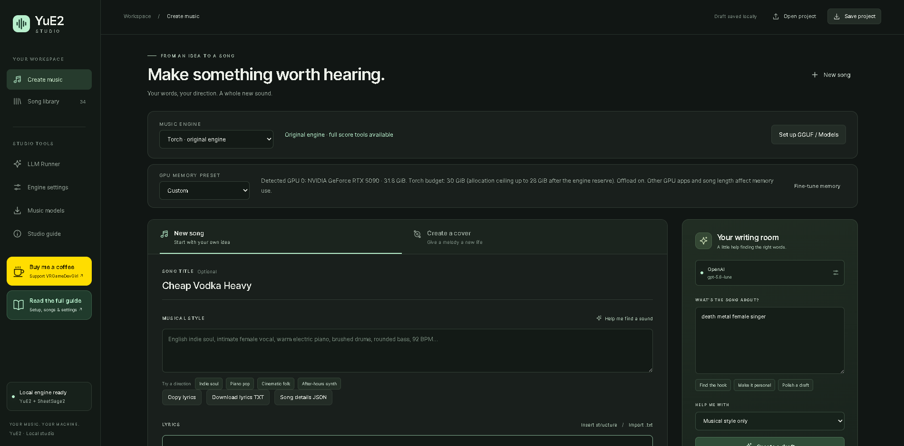
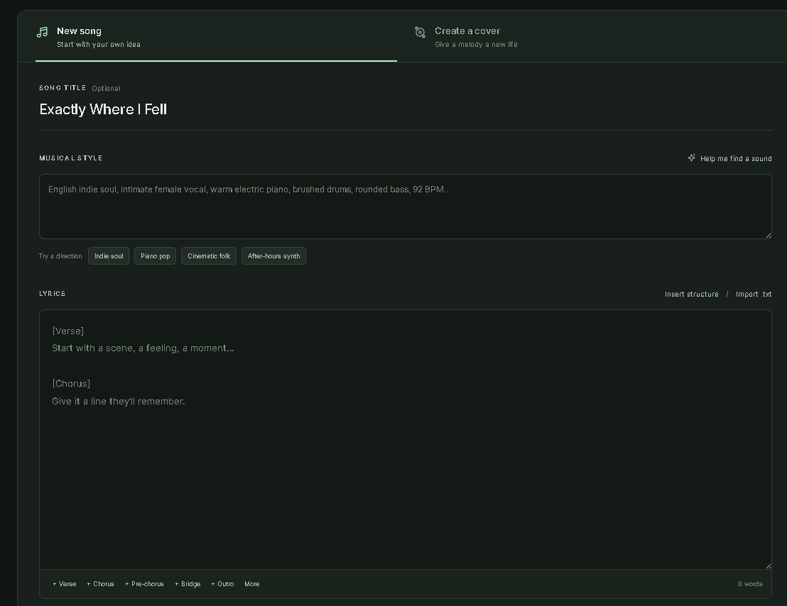
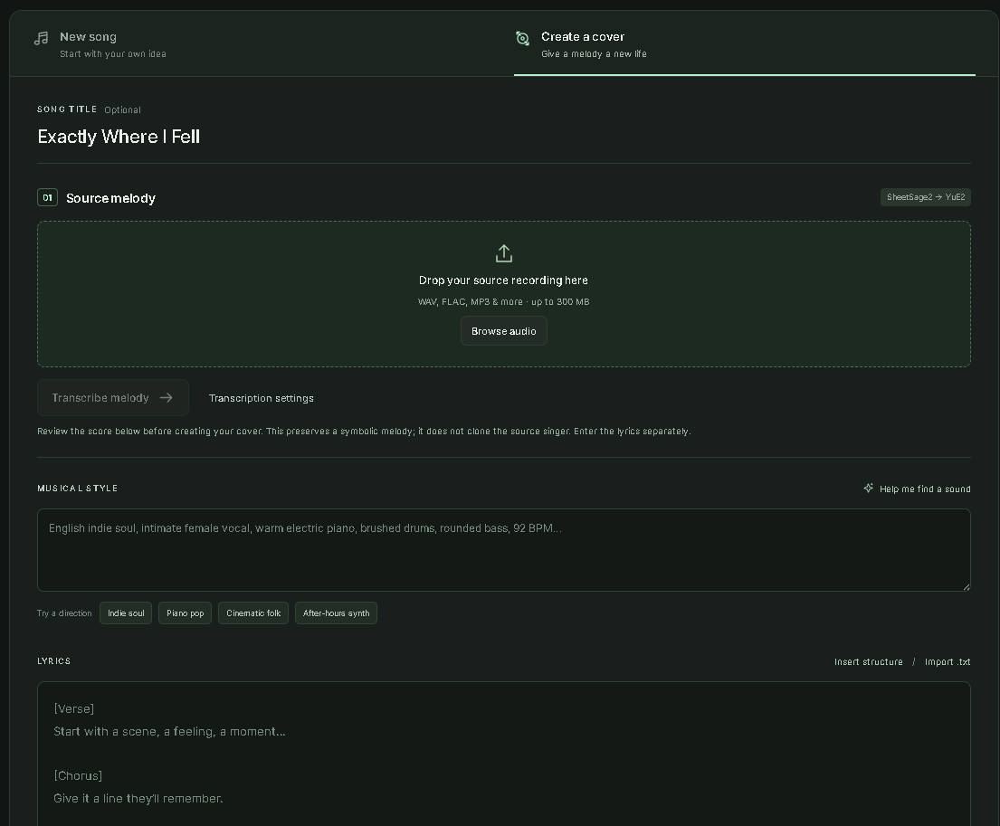
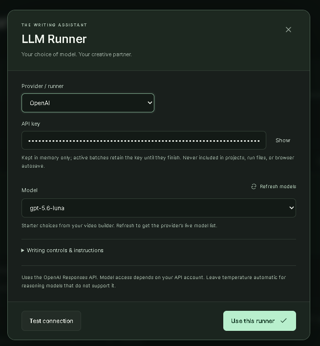
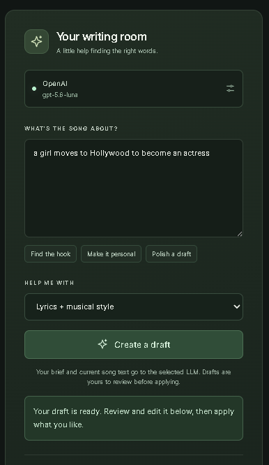
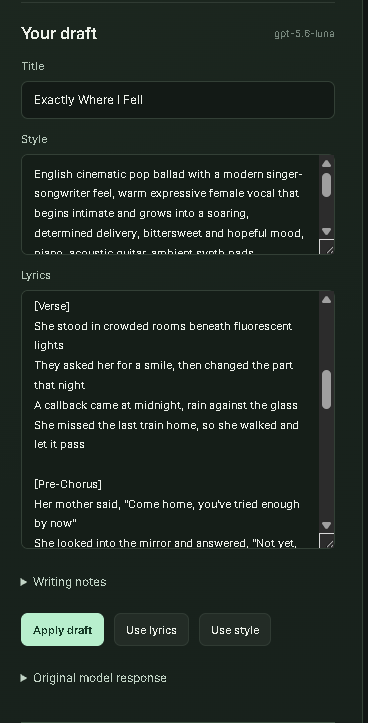
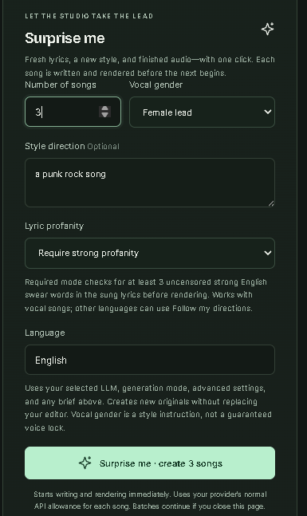

# YuE2 Studio

A local web studio for **YuE2** with original songs, melody covers, an LLM writing room,
automatic song batches, and detailed generation controls. Custom HTML/CSS/JavaScript UI;
no Gradio, Node build, or extra runtime Python dependencies beyond the installed engines.



*Write lyrics, shape a style, and generate music in one local workspace. See the [illustrated guide](docs/studio.md) for each part of the UI.*

## 1. Install YuE2 first

Follow the **[official YuE2 installation and quick start](https://github.com/multimodal-art-projection/YuE#quick-start)**.
Make sure its example can generate a song before adding Studio. The old YuE v1 branch is
not compatible. This add-on targets **yue2-infer 0.1.6**; the tested upstream commit is
`92a73cc7652fcc1f937855e4b765e0a0edd7ff2e`.

The upstream baseline is Python 3.12 and a BF16-capable NVIDIA GPU with 24 GB VRAM.
Studio's Windows torch/cuDNN compatibility path was also tested on an RTX 5090.
Long songs can still exceed VRAM. See the [settings and performance guide](docs/settings.md).

## 2. Clone Studio inside your installed YuE2 folder

From the folder containing YuE2's `src`, `.venv`, and `models`:

```powershell
git clone https://github.com/vrgamegirl19/Yue2_Studio.git
cd Yue2_Studio
.\"Start Yue2 Studio.bat"
```

Or double-click **Start Yue2 Studio.bat** inside `Yue2_Studio`.
The launcher installs the UI into the parent YuE2 folder, backs up replaced files,
and opens **http://127.0.0.1:7862**. No pip reinstall is needed for the add-on.

```text
Your-YuE2-folder/
  .venv/
  models/
  src/yue2/
  Yue2_Studio/                 ← clone this repository here
    Start Yue2 Studio.bat
    install_studio.py
```

The installer modifies `src/yue2/cuda_graph.py` to detect builds without compiled
Flash Attention, keeping fast CUDA graphs through cuDNN/SDPA. It also installs the
Studio package, launcher, and score/transcription helper scripts. Existing files
that change are backed up in the parent `.studio-backups/<timestamp>/` folder.
Review custom changes before installing. Stop servers on alternate ports manually
before updating; the installer checks the default port 7862.

### Linux or a different Python environment

Use the Python interpreter that already runs YuE2:

```bash
# From the Yue2_Studio clone:
../.venv/bin/python install_studio.py
../.venv/bin/python ../launch_studio.py
```

For a clone outside the YuE2 folder, use `install_studio.py --target /path/to/YuE2`,
then run `/path/to/YuE2/launch_studio.py` with its environment. Windows launchers
assume the standard nested layout. `--check` validates without installing.

## 3. Check your paths, then create

In **Advanced settings**, select your model and VAE paths and a GPU memory budget
appropriate to your hardware. Default folders are `models/YuE2-3B` and `models/YuE2-Vae`
under YOUR YuE2 root. If you used upstream's Hugging Face cache instead, enter the
Hub IDs `m-a-p/YuE2-3B` and `m-a-p/YuE2-Vae`; disable Offline model loading if downloads
are needed. Paths are resolved locally; this repository includes no weights.

- **New song:** enter style and section-tagged lyrics, then create music.
- **Writing room:** choose an LLM provider, refresh its model list, enter your own
  API key or local endpoint, and generate/edit lyrics and styles.
- **Surprise me:** choose batch size, vocal gender, style, language and optional
  required profanity. Songs are written and rendered sequentially.
- **Covers:** use your own ABC, or configure the separate SheetSage2 environment
  and models using the [upstream cover guide](https://github.com/multimodal-art-projection/YuE/blob/main/docs/covers.md).
  Review the transcribed melody before rendering. Covers do not clone a singer.
- **Lyrics export:** copy section-tagged lyrics or download TXT and song-details JSON for your video workflow, from drafts, the editor, or saved runs.
- **Progress and library:** watch stages, token speed, and synthesis steps; play or
  download completed songs and inspect saved settings and logs.

## Experimental GGUF / lower-VRAM engine

Studio also has an **audio.cpp** backend for [audio-cpp/Yue2-3B-GGUF](https://huggingface.co/audio-cpp/Yue2-3B-GGUF).
It requires a separate Yue2-capable audio.cpp executable, a main GGUF, a VAE GGUF,
and four sidecars. Q8 + F16 VAE is the default GGUF combination; Q4 is selectable.
Select **Advanced settings → Models & runtime → Inference backend → audio.cpp**, then
configure the **audio.cpp / GGUF** group. `torch` stays the overall default.

Original songs, supplied-ABC covers, Surprise me and audio downloads use the same UI.
Plan-only output and generated ABC export currently require torch. GGUF outputs are
marked for review because the CLI does not return structured truncation flags.
Q8 + F16 CUDA generation has been tested on Windows with an RTX 5090; Q4 and other
devices remain unvalidated locally. See the [setup, test steps, limitations and
memory guide](docs/gguf.md) for the measured result and its limits.

## Speed defaults

`torch` CUDA graphs, no weight quantization, AR offloading disabled, optional model
hash verification disabled, and transcription tensor exports disabled. Baseline
sampling and 32 synthesis steps remain intact. Hash verification is a provenance
tradeoff; fewer synthesis steps and shorter token limits change the result, so they
are documented options rather than hidden speed tricks. Existing saved drafts
retain their settings; use Restore defaults in Advanced settings to adopt new defaults.

For memory failures, enable **Offload autoregressive model**, then generate again.
This trades weight-transfer time for lower synthesis memory use. Keep `torch` enabled.

## Updates and shutdown

Finish your jobs and run **Stop Yue2 Studio.bat**, then:

```powershell
# Inside the Yue2_Studio clone:
git pull
.\"Start Yue2 Studio.bat"
```

The launcher installs changed files with backups. Closing the last browser tab
stops an idle server after about 15 seconds; active jobs and batches finish first.
Refreshing or another open tab keeps it running. Stop explicitly before updating.
Your runs stay under the parent `runs/studio/`; keys are entered per browser session.

## Documentation

- [Full workflow guide](docs/studio.md)
- [Every advanced setting, defaults, performance and troubleshooting](docs/settings.md)
- [Official YuE2 music skill and formatting](https://github.com/multimodal-art-projection/YuE/tree/main/skills/yue2-music)

## License and credits

Studio code is distributed under [Apache-2.0](LICENSE). See [NOTICE](NOTICE) and
[third-party notices](THIRD_PARTY_NOTICES.md) for upstream attribution and modifications.
Model weights are not included and have their own [model license](MODEL_LICENSE).
This is a community UI, not an official upstream release. LLM services use recipients'
own accounts and provider terms.

This repository contains no songs, uploads, API keys, caches or Python environments.
The server is local-only; cloning gives each user their own studio, not access to yours.

## See the Studio

| Create a song | Create a cover |
| --- | --- |
|  |  |

| LLM Runner | Advanced settings |
| --- | --- |
|  |  |

| Writing room | Review your draft | Surprise me |
| --- | --- | --- |
|  |  |  |

Click any screenshot to see it full size. The [illustrated guide](docs/studio.md) walks through each screen.
