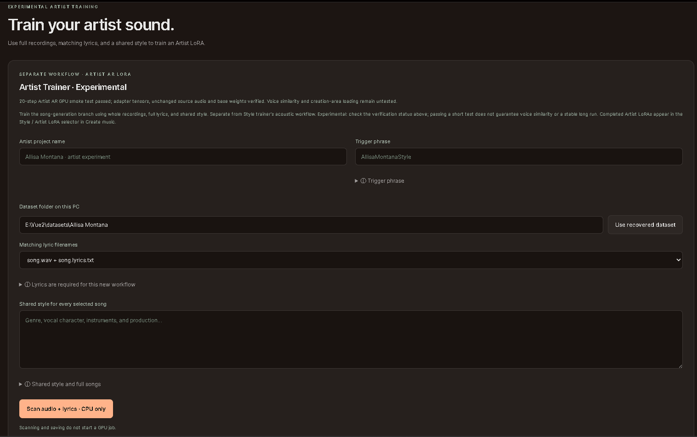
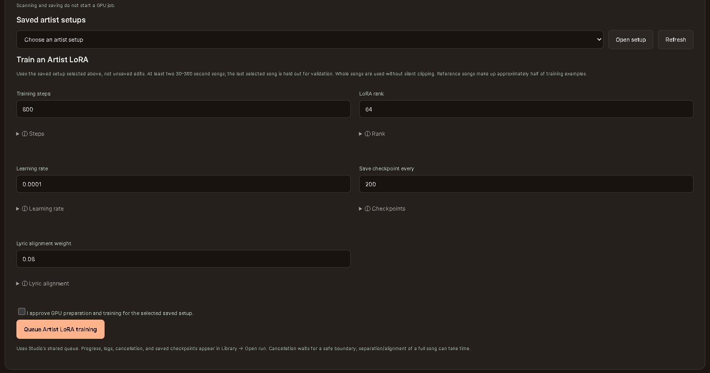

# Artist Trainer and playback — experimental

## Setup walkthrough

This workspace capture shows an example path, a local-only recovery shortcut and
a historical test banner. Those are not a supplied dataset or verification of
your PC. Use the release setup controls described below.

Artist trainer is its own sidebar entry below Style trainer. It learns an AR
adapter from full songs and lyrics; Style Trainer learns an acoustic adapter from
clips without lyric sidecars. Neither guarantees voice cloning.

1. Open Artist trainer and inspect its five model locations. They auto-fill from
   saved Artist paths, available Style model/VAE paths, or default folders under
   your own installation. A filled field does not mean the files exist.
2. Click **Check setup**. Review model terms before explicitly preparing paths /
   downloading missing models. Valid local files are reused; invalid existing
   folders are not overwritten. Install the separate Artist runtime with its own
   confirmation. These queue actions do not start training or change normal Studio Python.
3. After model preparation finishes, reload the page to display the registered
   paths, then check again. Do this before entering unsaved dataset edits. The
   check verifies files and CPU imports, not available training VRAM or quality.
4. Choose a dataset folder and its lyric suffix. `My song.wav` pairs with
   `My song.lyrics.txt` when `.lyrics.txt` is selected, or `My song.txt` when `.txt`
   is selected. Scan reads direct files, not subfolders. Use UTF-8 full lyrics,
   preferably with [Verse]/[Chorus] tags; a style caption is not a lyric file.
5. Select at least two complete 30–360 second recordings. Review lyrics against
   each song, exclude errors/unwanted songs, and confirm review. Filenames alone
   do not establish a match. Use recordings you have permission to train on.
6. Enter a name, shared style and trigger, then save the setup. No per-song style
   sidecar is required. A consistent singer/style is easier to evaluate than a
   mixed collection, but does not guarantee singer identity. The last selected
   song is held out for validation. Changed source files require a rescan/new save.
7. Select the saved setup, review training controls and explicitly confirm GPU use.
   The queue uses the saved dataset/style, not unsaved edits, and freezes the chosen
   controls and model/runtime paths. It does not coordinate other GPU applications.

The **model / vae** paths are the full PyTorch generation model and decoder.
**mert** extracts audio features; **encoder** contains the community semantic
encoder and acoustic companion; **regularizer** supplies reference songs/tokens
mixed with your dataset. Opening the page downloads nothing. Allow space for full
models, a separate runtime, caches and adapter checkpoints. See [setup details](artist-setup.md).

## Training controls and progress

The screenshot shows older **800 / 200** values; current defaults are **500 / 250**.

| Control | Default | Meaning |
| --- | --- | --- |
| Training steps | 500 | Optimizer updates; two song examples per update, not two full dataset passes |
| Save checkpoint every | 250 | Intermediate adapter snapshots for comparison |
| Rank | 64 | Adapter capacity; higher can use more memory/storage without better results |
| Learning rate | 0.0001 | Update size; overly aggressive learning can degrade results |
| Alignment weight | 0.08 | English lyric-timing supervision; 0 skips separation/alignment, not lyrics |

Click the information disclosures for supported ranges and tradeoffs. These are
starting values, not a guarantee that 500 steps is best. Artist uses complete songs,
not the Style Trainer clip-length setting. Generation GPU presets do not automatically
tune training speed, memory use or batch size.

Open **Song library → Open run** for encoding, vocal separation, lyric alignment,
validation, steps, loss and checkpoint artifacts. First-use alignment downloads
Demucs/MMS weights. Preparation can take longer than a short training run and
happens before optimizer steps. Confidence and loss are not quality scores.

Checkpoints/final adapters live in the run's `result` folder. They contain adapter
weights, not optimizer/RNG state: exact resume is not implemented. Cancellation
waits for a safe boundary; force-closing can lose unsaved work. Keep completed
checkpoints and logs after a failure. No comparison song is generated automatically.

## Playback and portability

Completed Artist runs appear in **Style / Artist LoRA**, including Surprise me.
Selecting an adapter offers its embedded training style in both creation style
boxes; existing text requires confirmation. You can edit the result. Surprise me
can lock that style while the LLM writes new titles and lyrics.

Artist playback requires **No score**, **Torch/Torch-eager**, **quantization None**
and **AR offloading disabled**. Incompatible settings fail rather than silently
changing backend or generation mode. GGUF is unsupported. Only one Style adapter
or Artist bundle can be selected; arbitrary LoRA stacking is not supported.

An Artist bundle contains its AR safetensors adapter, sibling `manifest.json`,
and the exact pinned community NAR companion referenced by that manifest. Keep
these together when transferring a bundle. Relative companion paths resolve from
the manifest folder; absolute paths refer to that PC. A standalone safetensors file
without its manifest/companion is insufficient. Checkpoints can be selected via
the local-path control while retaining the same sibling manifest.

The queue freezes adapter, companion and base-model identities. Playback checks
those identities against the actual files before generating. Artist deltas apply
to semantic generation and acoustic-prefix conditioning; the companion applies
to acoustic synthesis. Every modified weight is restored after each stage,
including failure/cancellation paths. No encoder/MERT is needed merely to play an
already trained bundle; the base YuE2 model, VAE and companion are needed.

Strength scales the Artist AR delta. At any nonzero strength, the companion stays
at its trained full strength. Zero disables both; it is not an AR-only comparison
with an unchanged companion. None selects original YuE2. Increased strength or
longer training is not a guarantee of singer similarity or better music.

The installer accepts stock upstream 0.1.6 and the known merged Style Trainer
pipeline, backs up replaced files, and refuses unfamiliar pipeline or adapter
code. It does not download models or install Artist dependencies automatically.

## Comparing and troubleshooting

Same seed is not an exact replay guarantee. Tested No score/Torch baseline-only
repeats varied even with identical style, lyrics and settings. The exact cause
is unconfirmed. Keep original files and compare multiple baseline/LoRA pairs;
see [comparison guidance](studio.md#seeds-and-comparing-results). The companion
can change the sound even when a new AR adapter has learned little, so a difference
alone is not evidence of singer learning.

- **Missing LoRA:** refresh the list. For intermediate checkpoints use their local
  path, retaining the sibling manifest and referenced companion. Do not remove a
  run folder while using its adapter.
- **Incompatible mode:** use No score, Torch/Torch-eager, None quantization and AR
  offloading off. A generation GPU preset may have changed offloading. No GGUF.
- **Missing lyrics:** check the filename suffix and audio stem. Zero alignment
  weight does not make lyric files optional.
- **OOM:** free competing GPU workloads and review the failed log and training
  controls. Generation memory presets do not tune this trainer; saved adapter
  checkpoints do not provide exact resume.
- **Abrupt generation ending:** inspect token-limit/truncation warnings. Training
  steps and save frequency do not control generated song length.

Fresh isolated setup, full-song alignment, a two-update rank-64 checkpoint test,
a 9,529-token backward test and playback passed on an RTX 5090. Exact parameter
restoration passed; repeated sampled songs were not identical. This is not
all-hardware, long-training or singer-quality certification. [Test scope](artist-setup.md).
