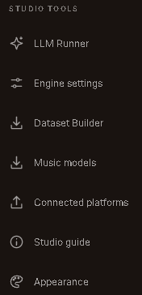
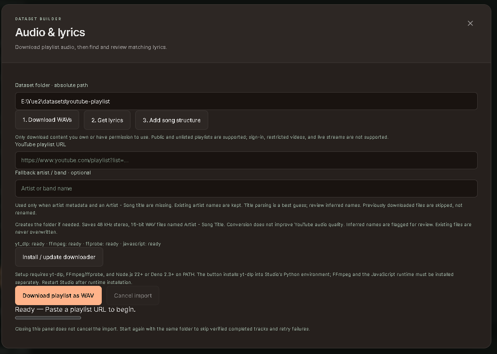
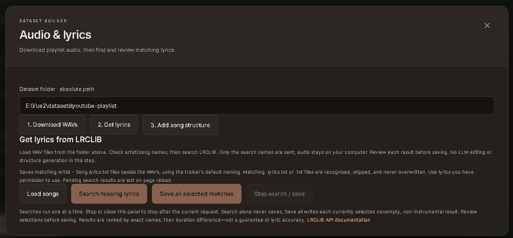
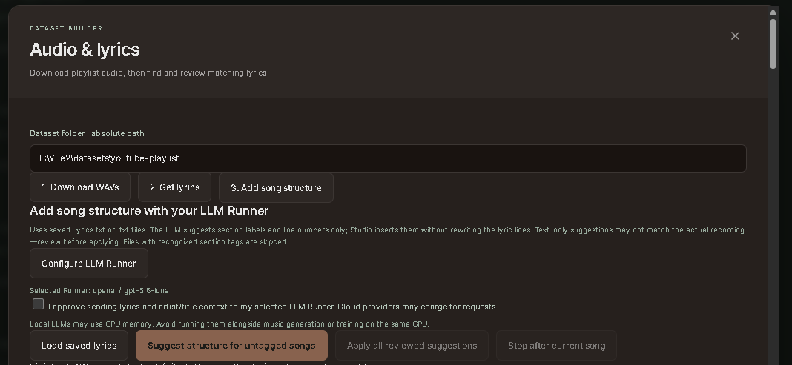

# Dataset Builder: playlist audio and lyrics

Dataset Builder prepares local audio and lyric sidecars for Artist Trainer. It does
not start training. Open **Studio Tools → Dataset Builder**, choose one absolute
dataset folder, and move through the three tabs in order. Use only audio and lyrics
you have permission to download and use.

## 1. Download WAVs

Paste a public or unlisted YouTube playlist URL and choose **Download playlist as
WAV**. For a single-artist playlist with song-only titles, enter the optional
**Fallback artist / band**. Real artist metadata takes priority, followed by a title
that clearly follows `Artist - Song`, then the fallback. Numbered uploads such as
`02   Song - Album` use the fallback rather than treating the track number as an
artist. Filename inference is heuristic, so review the output.

The importer produces 48 kHz stereo PCM16 WAV files with Windows-safe names.
Transcoding does not restore quality lost in the source. Name collisions gain the
YouTube video ID, and existing files are never overwritten. Individual errors do not
stop the remaining queue. Cancel preserves completed WAVs; restarting with the same
playlist and folder verifies and skips completed tracks while retrying failures.

Requirements:

- `yt-dlp[default]` in Studio's Python environment;
- FFmpeg and ffprobe on `PATH`; and
- Node.js 22+ or Deno 2.3+ on `PATH`.

On Windows, Studio can also detect a private Node distribution at
`tools/dataset-runtime/node-*/node.exe` without changing system `PATH`.
**Install / update downloader** installs yt-dlp only; it does not install FFmpeg or
Node/Deno. Restart Studio after installing a runtime or changing `PATH`.

The output folder's `.playlist-import/manifest.json` records artist, title, album,
duration, source URL, filename and size. Keep it for verified skipping and later
metadata use. Partial downloads stay under `.playlist-import`. Worker and installer
logs are saved in `runs/dataset-imports/<id>/run.log`. Closing the panel does not
cancel an import; explicitly stopping Studio does.

Signed-in/restricted videos and live streams are unsupported. The importer does not
automatically bypass YouTube bot checks. Do not run two Studio instances importing
into the same output folder. PCM16 stereo uses about 11.5 MB per minute.

## 2. Get lyrics

Select **Get lyrics**, confirm the dataset folder, and choose **Load songs**. Studio
reads saved playlist metadata, WAV filenames and WAV duration. Correct artist/title
fields before searching when needed; edits affect only the query, not the WAV name.

**Search missing lyrics** calls [LRCLIB's documented `/api/search`
endpoint](https://lrclib.net/docs) with `artist_name` and `track_name`. No API key or
new Python package is required, and audio is not uploaded. LRCLIB returns at most 20
candidate records per song search; this is not a 20-song queue limit. Searches run
one at a time. Per-song failures remain retryable, and an LRCLIB rate-limit response
stops the queue so you can retry later.

Candidates are ranked by exact artist/title first, then duration difference. Review
the artist, title, album, duration and lyric preview; ranking is not proof of lyric
accuracy. Search alone never saves. Choose **Save reviewed lyrics** for one result or
**Save all selected matches** for all current, nonempty, non-instrumental selections.
Bulk save continues past individual failures and reports what remains.

New sidecars use the WAV basename plus `.lyrics.txt`. Both `song.lyrics.txt` and
`song.txt` are recognized automatically by Dataset Builder and Artist Trainer; the
trainer's selected convention wins when both exist, with `.lyrics.txt` preferred by
default. Existing matching files are skipped and never overwritten. Plain LRCLIB
lyrics are preferred; when only synchronized lyrics exist, timestamps are stripped.
Saved files must fit Artist Trainer's 64 KB per-song limit. Page reload discards
unsaved search results.

## 3. Add song structure

Select **Add song structure** and **Load saved lyrics**. Configure the existing LLM
Runner, then explicitly approve sending lyric text and artist/title context to it.
Cloud providers may charge for requests. A local runner may consume GPU memory needed
by song generation or training; avoid running both on the same GPU simultaneously.
No audio is sent because this step analyzes text only.

The dedicated instruction asks for section labels and original line numbers—not
rewritten lyrics. Studio validates the returned JSON and inserts the accepted tags
into the original lines locally. Words, punctuation, repetitions and line order are
preserved. Invalid labels, invalid boundaries and truncated responses are rejected.
Files that already contain recognized structure tags are skipped rather than relabeled.

Generate one suggestion or process all untagged songs. Compare original and proposed
text, then review individually or choose **Mark all suggestions reviewed**. Nothing
changes on disk until you choose **Apply reviewed structure** or **Apply all reviewed
suggestions**. Each apply preserves an exact original-byte backup under
`.lyrics-backups`. A suggestion is rejected if the matching file changed after review.

Text alone cannot verify the structure of the recording, so section labels remain
provisional. Confirm important boundaries and that the lyrics match the audio. Stop or
close the panel to stop after the current operation. Reloading discards unapplied
suggestions.

After applying tags, rescan Artist Trainer and save a new setup. Saved setups contain
lyric snapshots and hashes, and editing sidecars does not alter an existing setup or a
running training job.
