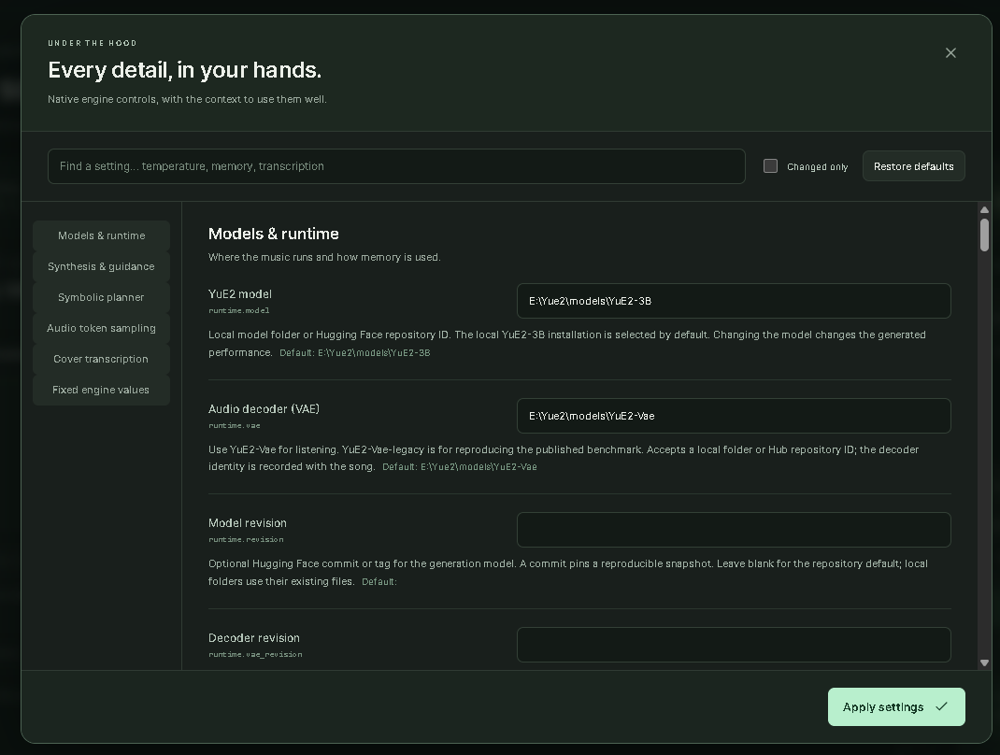
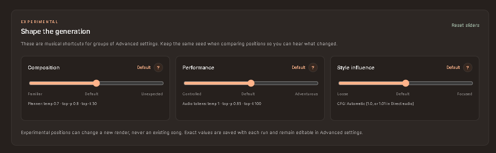

# Settings, performance and troubleshooting

Defaults favor the fast validated execution path. Speed, memory, output length and musical quality are different controls; a smaller token ceiling can cut a song off.

*The screenshot shows example paths, not required folder locations. Your defaults resolve against your own YuE2 installation.*

## Everyday controls

See [Shape the generation](#shape-the-generation) for the experimental preset sliders.

**Artist LoRA exception:** playback requires No score, Torch/Torch-eager,
quantization None and AR offloading disabled. Memory presets can change offloading;
recheck it before rendering. These generation settings do not tune Artist training.
See [Artist controls](artist-trainer.md#training-controls-and-progress).

- **Full / melody / off:** full plans harmony and melody, melody plans lead melody, off skips score planning. Off avoids planner time but changes conditioning.
- **Seed:** records a sampling condition, not an exact replay guarantee. Tested No score/Torch runs varied even with identical seed, style, lyrics and settings and no LoRA. The exact cause is unconfirmed. Preserve original audio and compare multiple pairs; see [comparison guidance](studio.md#seeds-and-comparing-results).
- **Style:** language, genre, vocal delivery, instruments, groove and BPM. Use lyrics for words and section tags.
- **LLM runner:** provider/model discovery, endpoint and API key; maximum output tokens caps the writing response, timeout controls waiting, temperature controls text variation, local context controls local LLM memory. These do not change Yue2 sampling.
- **Surprise me:** 1–50 songs, vocal gender, style, language. Require strong profanity checks at least 3 uncensored strong English swear-word occurrences in sung lines before rendering. A failed draft/render stops the remainder.

## Models & runtime

Where the music runs and how memory is used.

| Setting (`key`) | Default | What it does |
| --- | --- | --- |
| YuE2 model (`model`) | <YuE2 root>\models\YuE2-3B | Local model folder or Hugging Face repository ID. The local YuE2-3B installation is selected by default. Changing the model changes the generated performance.  |
| Audio decoder (VAE) (`vae`) | <YuE2 root>\models\YuE2-Vae | Use YuE2-Vae for listening. YuE2-Vae-legacy is for reproducing the published benchmark. Accepts a local folder or Hub repository ID; the decoder identity is recorded with the song.  |
| Model revision (`revision`) | Automatic / blank | Optional Hugging Face commit or tag for the generation model. A commit pins a reproducible snapshot. Leave blank for the repository default; local folders use their existing files.  |
| Decoder revision (`vae_revision`) | Automatic / blank | Optional independent Hub commit or tag for the VAE. This does not change the generation model revision.  |
| Compute device (`device`) | auto | auto selects CUDA, then Apple MPS, then CPU. Enter cuda:0 or cuda:1 for a specific GPU. The supported baseline is a BF16-capable NVIDIA GPU with 24 GiB VRAM; CPU execution can be extremely slow.  |
| GPU memory budget · GiB (`memory_budget_gib`) | 24.0 | Total runtime memory budget. The CUDA pipeline reserves 2 GiB and caps allocation against physical VRAM. Smaller budgets can use smaller decode tiles; they do not shorten the song or reduce synthesis steps. Minimum: 2.1. |
| Inference backend (`backend`) | torch | torch uses fast CUDA graphs. Builds without Flash Attention use cuDNN attention when supported, otherwise SDPA, while retaining graphs. torch-eager disables graphs for troubleshooting and is substantially slower. vllm needs separate fast dependencies and a supported platform. Choices: torch, torch-eager, vllm, audio.cpp. audio.cpp uses its own settings below; PyTorch runtime settings do not apply. |
| Weight quantization (`quantization`) | none | none preserves the baseline model precision. fp8 uses the optional runtime FP8 path to reduce weight memory; hardware/backend support and output quality require separate validation. Choices: none, fp8. |
| Offload autoregressive model (`offload_ar`) | False | Release/offload the autoregressive model before acoustic synthesis to reduce peak GPU memory. Reloading increases latency. This is not a lower-quality sampling preset.  |
| Offline model loading (`local_files_only`) | True | Only use local files and already cached snapshots. Disable to allow Hugging Face downloads. LLM API calls are controlled separately by your chosen runner.  |
| Hugging Face cache folder (`cache_dir`) | <YuE2 root>\hf-cache | Cache for model snapshots. Existing local model folders take precedence. For private or gated Hub repositories, set HF_TOKEN in the launcher environment; secrets are never written to run manifests.  |
| Verify model hashes (`verify_hashes`) | False | Hash model files when opening the pipeline so each run records exact weight identity. Large files can take time to verify. Disabling trades provenance strength for faster startup.  |
| VAE tile core frames (`vae_core_frames`) | Automatic / blank | Blank uses the engine default: 512 at budgets of 12 GiB or less, otherwise 1024. Larger tiles use more memory. Applies to tiled decoding; the engine may decode in one pass when memory permits. Minimum: 1. |
| Detailed engine progress (`progress`) | True | Show live stage messages, token counts, and elapsed times in the run log. No artificial percentage is calculated: token limits are ceilings, not known completion targets.  |

## audio.cpp / GGUF (experimental)

See [GGUF installation and limitations](gguf.md) before selecting this backend.

| Setting (`key`) | Default | Explanation |
| --- | --- | --- |
| audio.cpp executable (`executable`) | Blank | Full path to audiocpp_cli.exe on Windows or audiocpp_cli on Linux. Use a build with Yue2 support from the audio.cpp dev branch. Studio does not install or download the binary. |
| GGUF model folder (`model_dir`) | <YuE2 root>\models\Yue2-3B-GGUF | Folder containing the main GGUF, VAE GGUF and sidecars subfolder. Download only the component precision you want plus all sidecars. |
| Main GGUF (`model_gguf`) | yue2-3b-q8_0.gguf | Q8 is the balanced default. Q4 uses smaller weights but is not necessarily faster or identical in quality. Paths are relative to the GGUF folder. Choices: yue2-3b-q8_0.gguf, yue2-3b-q4_0.gguf, yue2-3b-bf16.gguf. |
| GGUF decoder (`vae_gguf`) | yue2-vae-f16.gguf | F16 reduces VAE weight memory. F32 uses more memory. The GGUF decoder is separate from the PyTorch VAE. Choices: yue2-vae-f16.gguf, yue2-vae-f32.gguf. |
| audio.cpp device backend (`backend`) | cuda | Must be compiled into your audio.cpp binary. CUDA is the NVIDIA path; other backends depend on your build and are not locally validated. Choices: cuda, cpu, vulkan, metal, hip. |
| audio.cpp CPU threads (`threads`) | 8 | CPU threads for the C++ engine. More is not always faster when sharing the CPU with other programs. |
| Model weight context mb (`model_weight_context_mb`) | 6144 | Main-model weight context capacity. Units are MiB. These are upstream context/arena capacities, not a measured peak-VRAM estimate or a global memory budget. Smaller values can cause allocation failures. |
| Vae weight context mb (`vae_weight_context_mb`) | 1536 | VAE weight context capacity. Units are MiB. These are upstream context/arena capacities, not a measured peak-VRAM estimate or a global memory budget. Smaller values can cause allocation failures. |
| Ar prefill graph arena mb (`ar_prefill_graph_arena_mb`) | 4096 | Graph arena for processing the prompt and score prefix. Units are MiB. These are upstream context/arena capacities, not a measured peak-VRAM estimate or a global memory budget. Smaller values can cause allocation failures. |
| Ar decode graph arena mb (`ar_decode_graph_arena_mb`) | 1536 | Graph arena for autoregressive token decoding. Units are MiB. These are upstream context/arena capacities, not a measured peak-VRAM estimate or a global memory budget. Smaller values can cause allocation failures. |
| Nar graph arena mb (`nar_graph_arena_mb`) | 6144 | Graph arena for acoustic synthesis. Units are MiB. These are upstream context/arena capacities, not a measured peak-VRAM estimate or a global memory budget. Smaller values can cause allocation failures. |
| Vae graph arena mb (`vae_graph_arena_mb`) | 1536 | Graph arena for waveform decoding. Units are MiB. These are upstream context/arena capacities, not a measured peak-VRAM estimate or a global memory budget. Smaller values can cause allocation failures. |
| Model weight type (`model_weight_type`) | native | Native retains storage from the selected GGUF. Overrides can alter memory, speed and quality; support depends on the audio.cpp build. Choices: native, f32, f16, bf16, q8_0, q4_0, q4_k. |
| Vae weight type (`vae_weight_type`) | native | Native retains storage from the selected GGUF. Overrides can alter memory, speed and quality; support depends on the audio.cpp build. Choices: native, f32, f16, bf16, q8_0, q4_0, q4_k. |

## Synthesis & guidance

Audio rendering and native generation behavior.

| Setting (`key`) | Default | What it does |
| --- | --- | --- |
| Synthesis steps (`ode_steps`) | 32 | Number of midpoint integration steps that convert semantic tokens into acoustic latents. More steps cost time; fewer depart from the validated 32-step baseline. This is not a song-duration control. Minimum: 1. |
| Semantic guidance (CFG) (`cfg_scale`) | Automatic / blank | Blank uses 1.0 for full/melody or 1.01 for direct audio. Values above 1 strengthen text conditioning and can increase compute. With ABC, both CFG branches retain the same score. Higher is not automatically better. No CFG is applied to the ABC planner. Minimum: 0. Maximum: 20. |

## Symbolic planner

Used when generating a new ABC score. Bypassed for supplied scores and direct audio.

| Setting (`key`) | Default | What it does |
| --- | --- | --- |
| Temperature (`temperature`) | 0.7 | Scales token probabilities. Lower values are more predictable; higher values add variation. Zero selects greedily. This affects this stage only; it is separate from the LLM writing temperature. Minimum: 0. Maximum: 5. |
| Top p (`top_p`) | 0.9 | Nucleus sampling keeps the smallest token set whose cumulative probability reaches this value. Smaller values narrow variation; 1 disables this filter. Combines with top-k and temperature. Minimum: 0.001. Maximum: 1. |
| Top k (`top_k`) | 30 | Keep only this many highest-scoring next-token candidates. A smaller set is more conservative. Must be at least 1; this engine does not use 0 as an off switch. Minimum: 1. |
| Repetition penalty (`repetition_penalty`) | 1.005 | Penalizes tokens repeated in the recent window. 1 is neutral; above 1 discourages repetition; below 1 encourages it. Excessive penalties can disrupt recurring musical or score patterns. Minimum: 0.001. |
| Penalty window (`penalty_window`) | 100 | Number of recent tokens examined for repetition, from 1 to 100. A larger window discourages repetition over a longer span; this is measured in model tokens, not lyric words or beats. Minimum: 1. Maximum: 100. |
| Min tokens (`min_tokens`) | 32 | Minimum stage tokens before the end marker is permitted. A large minimum may force unnecessary content. Must not exceed maximum tokens. This does not enforce seconds of audio. Minimum: 0. |
| Max tokens (`max_tokens`) | 4096 | Hard upper bound for this stage, not a target length. Reaching it can truncate the score or song; the library displays truncation flags. More tokens increase runtime, memory pressure, and context consumption. Minimum: 1. |

## Audio token sampling

Controls the semantic music tokens before acoustic synthesis.

| Setting (`key`) | Default | What it does |
| --- | --- | --- |
| Temperature (`temperature`) | 1.0 | Scales token probabilities. Lower values are more predictable; higher values add variation. Zero selects greedily. This affects this stage only; it is separate from the LLM writing temperature. Minimum: 0. Maximum: 5. |
| Top p (`top_p`) | 0.95 | Nucleus sampling keeps the smallest token set whose cumulative probability reaches this value. Smaller values narrow variation; 1 disables this filter. Combines with top-k and temperature. Minimum: 0.001. Maximum: 1. |
| Top k (`top_k`) | 100 | Keep only this many highest-scoring next-token candidates. A smaller set is more conservative. Must be at least 1; this engine does not use 0 as an off switch. Minimum: 1. |
| Repetition penalty (`repetition_penalty`) | 1.2 | Penalizes tokens repeated in the recent window. 1 is neutral; above 1 discourages repetition; below 1 encourages it. Excessive penalties can disrupt recurring musical or score patterns. Minimum: 0.001. |
| Penalty window (`penalty_window`) | 50 | Number of recent tokens examined for repetition, from 1 to 100. A larger window discourages repetition over a longer span; this is measured in model tokens, not lyric words or beats. Minimum: 1. Maximum: 100. |
| Min tokens (`min_tokens`) | 200 | Minimum stage tokens before the end marker is permitted. A large minimum may force unnecessary content. Must not exceed maximum tokens. This does not enforce seconds of audio. Minimum: 0. |
| Max tokens (`max_tokens`) | 9000 | Hard upper bound for this stage, not a target length. Reaching it can truncate the score or song; the library displays truncation flags. More tokens increase runtime, memory pressure, and context consumption. Minimum: 1. |

## Cover transcription

Runs in the separate SheetSage2 environment, one GPU job at a time.

| Setting (`key`) | Default | What it does |
| --- | --- | --- |
| SheetSage2 Python (`python`) | <YuE2 root>\SheetSage2-venv\Scripts\python.exe | Python executable for the separate SheetSage2 installation. Its dependency pins differ from YuE2. Only a Python executable is accepted; this is not a shell command.  |
| SheetSage2 model (`model`) | <YuE2 root>\models\SheetSage2 | Local SheetSage2 folder or Hub ID. The released transcription helper loads the model’s custom Transformers code. Use your installed, reviewed snapshot.  |
| MERT base model (`base_model`) | <YuE2 root>\models\MERT-v2-FullSong | Verified MERT-v2-FullSong snapshot used by the SheetSage2 adapter. MERT features are not directly fed into YuE2.  |
| Transcription revision (`revision`) | Automatic / blank | Optional commit pin for both model weights and remote model code. Leave blank for the installed local files.  |
| Melody to transcribe (`task`) | melody-full | Full lead melody includes instrumental passages. Vocal melody focuses on singing. Full score also transcribes chords and is useful for melody-and-harmony regeneration. Transcription does not extract lyric text. Choices: melody-full, melody-vocal, full. |
| Transcription device (`device`) | cuda | Select cuda, cuda:0, or another supported Torch device. SheetSage2 exits and frees its allocations before a music job begins.  |
| Transcription precision (`dtype`) | bf16 | bf16 is the normal GPU preset. fp32 increases memory use and can help compatibility; it is not a guarantee of better transcription. Choices: bf16, fp32. |
| Transcription preset (`preset`) | default | default is the release’s normal transcription preset. paper is its benchmark preset. Inspect resulting notes and warnings before using them as a cover condition. Choices: default, paper. |
| Crop source to seconds (`max_seconds`) | Automatic / blank | Blank processes the entire recording. Enter a positive value only when you explicitly want to crop from the beginning. The original uploaded file is retained. Minimum: 0.01. |
| CPU threads (`threads`) | 4 | CPU worker threads used during transcription. More threads can help preprocessing but also increase CPU contention. Minimum: 1. |
| Offline transcription (`offline`) | True | Use only installed or cached SheetSage2 and MERT files. Disable only if you want the transcriber to resolve/download a Hub snapshot.  |
| Window overlap · seconds (`overlap_seconds`) | Automatic / blank | Blank follows the preset: 200 seconds for default, 100 for paper. Overlap carries earlier transcribed context into the next window. Require lookahead ≤ overlap < the model’s 300-second window. Excessive overlap can fill the decoder context. Minimum: 0. Maximum: 299.99. |
| Window lookahead · seconds (`lookahead_seconds`) | Automatic / blank | Blank follows the preset: 100 seconds for default, 0 for paper. Keeps right-hand audio context before accepting a window’s final notes. Must not exceed overlap. The paper preset fixes both values. Minimum: 0. Maximum: 299.99. |
| Export raw transcription logits (`export_logits`) | False | Save per-window raw decoder logits as safetensors. Intended for research and debugging; can produce very large files and increase CPU memory and disk use.  |
| Export constrained token scores (`export_scores`) | False | Save transcription token scores after grammar constraints. Useful for inspecting decoder decisions; these are not perceptual audio-quality scores.  |
| Export audio embeddings (`export_embeddings`) | False | Save MERT audio embeddings alongside the transcription. They are analysis artifacts, not YuE2 codec inputs.  |
| Export all MERT hidden layers (`output_hidden_states`) | False | Save all 24 MERT layer states for feature analysis. This can require substantial memory and disk space. Leave off for normal covers.  |

## Fixed engine behavior

| Item | Value | Notes |
| --- | --- | --- |
| Context window | 24,576 tokens | Fixed by the checkpoint protocol; shared by prompt, ABC, and music tokens. |
| ODE method | midpoint | The only supported synthesis integrator in this runtime. |
| Protocol version | yue2-native-v1 | Native text/ABC/music serialization. This is a compatibility identifier, not a creative setting. |
| Precision | BF16 AR/NAR · FP32 VAE | Baseline model precision. Optional FP8 weight quantization is exposed above. |
| Audio output | 48 kHz · stereo · FLAC | Native lossless result with audio, ABC, tokens, latents, timings and provenance retained. WAV download is available in the library. |
| VAE halo | 16 frames | Fixed tile overlap used by the public decoder. |
| GPU concurrency | 1 job | Song creation and transcription share one serial queue to avoid competing for GPU memory. |
| Duration / BPM / negative prompt | Musical conditions | There are no separate duration, BPM, reference-singer, or negative-prompt arguments. Describe tempo and instrumentation in Style; ABC can specify tempo exactly. Lyrics and score shape duration, but do not guarantee audio length. |

## Performance choices

- Keep **torch** for CUDA graph acceleration. torch-eager disables graphs and can be much slower.
- **Offload AR** can prevent synthesis out-of-memory failures in long songs, but transfers add latency. Each song already exits its own process; failures can be within-song memory peaks.
- Lower **ODE steps** only if you accept an unvalidated quality tradeoff; the default remains 32.
- Leave **CFG** automatic unless deliberately experimenting; guidance above 1 can require two branches.
- Do not raise the memory budget above physical VRAM. The engine subtracts a 2 GiB reserve. Account for ComfyUI, games and local LLMs on the same GPU.
- Hash verification is off by default to avoid optional verification work. Some native integrity/provenance work may still occur. Enable for stronger identity checks.
- GPU memory usage and total speed depend on song length, score complexity, backend, GPU and other applications. There is no universally fastest safe memory budget.

## Troubleshooting

**Missing model:** correct model paths or use Hub IDs and disable offline loading for downloads.

**CUDA out of memory:** song generation automatically retries once in a fresh process with expandable
allocator segments. Normal Torch generation also enables **Offload autoregressive model** for that retry;
Artist LoRA generation cannot use AR offloading. If the second attempt fails, close other GPU workloads,
load the failed request, shorten or simplify the song if appropriate, and generate a new run. **Retry saved
song** reuses the old settings.

**Missing Flash Attention:** this package retains CUDA graphs and uses supported cuDNN/SDPA attention. Reinstall the overlay if upstream updates replaced cuda_graph.py.

**Old UI after updating:** finish work, explicitly Stop Studio, run git pull in the add-on, Start, then refresh. Closing a browser while a batch runs deliberately leaves the server working.

**Logs:** Song library → Open run → Download log. Files are in the parent `runs/studio/<id>/run.log`. Do not publish full private projects or credentials when reporting issues.

**Covers:** SheetSage2 has a separate Python environment and models. Check transcription paths and review generated ABC.

**LLM returns clean lyrics:** use Require strong profanity for English lyrics or specify exact language and words in directions. The text check cannot guarantee audio intelligibility.

## GPU memory presets

The main page has **GPU memory preset** beside the engine controls. Selecting a
capacity applies the following native runtime settings. Auto detects NVIDIA GPU 0
and chooses the largest listed capacity that fits (allowing for reported capacity
rounding). It never changes your engine, lyrics, sampling, or downloaded model.
Choose manually for other GPUs/devices. Custom opens Advanced settings; changing
memory controls there updates the main label to Custom unless they match a preset.

| GPU capacity | Entered Torch budget | Maximum allocation after 2 GiB engine reserve | Offload AR |
| --- | --- | --- | --- |
| 8 GB | 6 GiB | 4 GiB | On |
| 12 GB | 10 GiB | 8 GiB | On |
| 16 GB | 14 GiB | 12 GiB | On |
| 24 GB | 22 GiB | 20 GiB | Off |
| 32 GB | 30 GiB | 28 GiB | Off |

All presets reset VAE tile size to automatic. Physical GPU limits may lower the
actual ceiling further. These are conservative starting budgets, not validated
minimum-hardware guarantees. The native engine's supported baseline is 24 GiB;
smaller presets may still fail and GGUF may be more appropriate. Offloading can
increase runtime. Other applications and long songs can cause memory pressure.

**GGUF does not use the Torch memory budget.** With GGUF selected, the summary
suggests Q4 for 8 GB and Q8 for the larger listed capacities. Select the suggested
model through Music models. The preset does not download/switch models or alter
GGUF graph arenas, whose safe capacities depend on the runtime and request. The
native budget is retained for when you switch back to Torch.

## Shape the generation

The screenshot uses older comparison wording. Keep inputs fixed, but compare
multiple runs: the same seed is not an exact replay guarantee.

These five-position presets change existing Python-engine settings. They are not
training controls, LoRA-strength controls or a promise of a particular singer.
Composition is bypassed in No score or with supplied ABC. All are disabled for GGUF.
Center uses engine defaults; Custom advanced values preserves manual settings.
Reset sliders resets only the fields below, not token limits or synthesis steps.

| Position | Composition: temperature / top-p / top-k | Performance: temperature / top-p / top-k | Style influence: CFG |
| --- | --- | --- | --- |
| 0 · lowest | 0.55 / 0.82 / 16 | 0.8 / 0.88 / 50 | 0.85 |
| 1 | 0.6 / 0.86 / 24 | 0.9 / 0.92 / 75 | 0.95 |
| 2 · default | 0.7 / 0.9 / 30 | 1.0 / 0.95 / 100 | Automatic |
| 3 | 0.85 / 0.94 / 45 | 1.1 / 0.97 / 140 | 1.05 |
| 4 · highest | 1.0 / 0.97 / 64 | 1.2 / 0.99 / 200 | 1.15 |

Automatic CFG is 1.0 for Full/Melody and 1.01 for No score. Guidance away from 1
can add a second branch and increase work. More adventurous sampling can trade
coherence for variation; stronger guidance is not automatically better.
Click **?** for explanations and caution bands, not hard failure thresholds.
Values are saved through the usual draft/project/run settings. Existing queued
jobs and finished songs are not changed by moving a slider.
