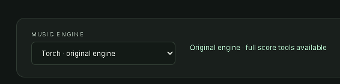
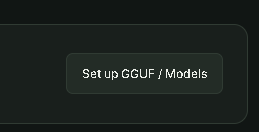
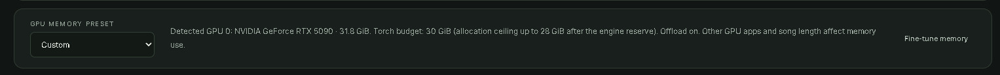

# YuE2 Studio · Beta

A local HTML/CSS/JavaScript music studio backed by the installed Python engines. No Gradio,
Node build, CDN, or additional runtime Python packages are needed.

## Launch

On Windows, double-click **Start Yue2 Studio.bat** inside your YuE2 installation.
It opens <http://127.0.0.1:7862>. Keep the launcher running; Ctrl+C stops the server and its active worker.
Double-click **Stop Yue2 Studio.bat** to stop a background studio. Launching again while the same
studio is already running simply opens it; it does not create a second queue.

```powershell
.venv\Scripts\python.exe launch_studio.py
# Optional alternate port or run folder:
.venv\Scripts\python.exe launch_studio.py --port 7863 --runs-dir runs/my-studio
```

The studio binds to loopback. It is a local application, not a public hosted service.
Model paths and cache directories default to this source checkout. `YUE2_KIT` can explicitly select
a different kit root containing `models` and `skills/yue2-music/scripts`.

**Windows backend:** Studio defaults to `torch` with CUDA graphs. Like the ComfyUI Yue2
worker, the engine checks compiled Flash Attention availability, using cuDNN attention
when supported (otherwise SDPA) when Flash Attention is missing. `torch-eager` remains an
explicit, slower troubleshooting option. Older saved drafts keep their selection;
choose **Advanced settings → Inference backend → torch** to restore fast generation.

## Choose an engine and GPU memory preset



Choose **Torch** for the native engine, or **GGUF** for audio.cpp. Switching keeps
your current song. GGUF needs a compatible engine and its separate model files.
**Install or build audio.cpp separately outside Studio. The UI downloads GGUF
weights, not the audio.cpp executable.** Torch users do not need audio.cpp.



Click **Set up GGUF / Models**, or **Music models** in the sidebar, to check engine
setup, download Q4/Q8/BF16 bundles, and select an installed model. See the
[GGUF setup guide](gguf.md) for requirements and experimental limitations.



Choose **Auto**, a GPU capacity, or **Custom**. Native presets set the Torch budget,
offloading, and automatic VAE tiles. GGUF shows a model suggestion instead of using
the Torch budget. Read the [preset table and limits](settings.md#gpu-memory-presets).
The screenshot shows Custom because the memory controls were adjusted manually.

## Create music


*Start with a style and sung lyrics. Use the section buttons to insert cues such as [Verse] and [Chorus].*

1. Choose **New song**. Give it an optional title.
2. Put language, genre, vocal character, instruments, groove and intended BPM in **Musical style**.
3. Write lyrics, or use the writing assistant. Insert section tags at the cursor. The native engine
   adds `[Tags]` and `[Lyrics]` wrappers; do not paste those wrappers into the editor.
4. Choose Full (melody + harmony), Melody (free accompaniment), or Direct audio (no symbolic score).
5. Use **Plan only** to inspect an ABC composition first, or **Create song** to render everything.
6. Open the run from the library. Listen, download FLAC/WAV, and inspect its actual logs and artifacts.

In the library, click the star beside a title to save a favorite, then choose
**Starred only** to find it again. Stars are stored with the run and survive a
Studio restart; starring a run does not change its generation settings or interrupt it.
Click the pencil beside a title to rename it (1–180 characters). This updates the
saved library label, not the original render inputs, audio tags, or artifact filenames.
Combine search and the existing run filters with **Created today**, **Created yesterday**,
**Last 7 days**, **Last 30 days**, or **Choose a date…**. Dates use your browser's
local calendar and the run's creation time, not its completion time. The last-7/30-day
presets include today. **Any date** removes the date restriction.

An empty lyrics field is allowed for instrumental requests; describe the instrumental intent in Style.
There is no supported exact-duration setting. Sampling maxima cap tokens, and the UI flags truncation
instead of calling a capped result a complete musical performance. All default sampling values and
32 midpoint synthesis steps are preserved.

## Surprise me and automatic batches


*Choose how many songs to create and the constraints each song should follow. The screenshot shows three female-led punk rock songs with required profanity.*

In the writing room, **Surprise me** invents a title, full lyrics and musical style, then immediately
renders the song. Choose **Number of songs** (1–50), **Vocal gender**, optional **Style direction**, and
**Language**. For example, set 5 songs, Female lead, and “warm acoustic soul, relaxed 90 BPM”. Leave
Style direction blank for a broader surprise. The brief above and your writing preferences also apply.

Each song gets a fresh concept and random seed. Earlier titles/lyrics are supplied to the LLM to avoid
repetition; duplicate drafts are rejected. Your selected generation mode and advanced settings are
snapshotted at launch. Existing editor lyrics and ABC are not used or overwritten: batches make new originals.
Vocal gender is expressed in the style condition; Yue2 does not provide a guaranteed voice lock.

Songs are written and rendered sequentially. The batch continues on the server after the browser closes.
**Stop batch** cancels its current render and prevents further writing/rendering, retaining finished songs.
An already-sent LLM request may finish and incur the provider's normal cost; its response is discarded after
stopping. Invalid/truncated drafts and failed renders stop the remaining batch. Token-capped audio stays
marked “Review ending” in the library. API credentials are held only in server memory during the batch,
never in the saved batch or song files. Restarted batches are marked interrupted and are not auto-resumed.

## Covers


*Upload a source recording, transcribe and review its melody, then enter the new style and lyrics.*

1. Choose **Create a cover** and upload a source recording, or import a native ABC score directly.
2. **Transcribe melody** runs the installed `SheetSage2-venv` interpreter and models. This is a real
   transcription job in the same serial GPU queue used by music generation.
3. Open its completed run and choose **Review melody in editor**. Review notes, meter, tempo and
   transcription warnings. The helper accepts the released native two-voice ABC dialect, not every
   possible ABC notation extension.
4. **Prepare melody** strips musical chord symbols and checks retained pitch/timing/meter invariants.
   Both melodic voices are preserved by default. Explicit Vocal/Ins selection silences the other part.
5. Enter target lyrics and style. Generate with Melody for new accompaniment, or Full to retain a
   supplied score's harmony too. Original source and transcription artifacts are retained.

This is symbolic melody conditioning. It does not clone singer identity, preserve waveforms, perform
lyric recognition, or provide exact acoustic note alignment. Review transcription and listen to the result.

## LLM Runner


*Select your provider and model, enter your own API key, and test the connection. Model availability depends on the selected provider and your account.*

Open **LLM Runner**, choose a provider, enter your API key, and **Refresh models**. The studio includes
the text-model starter lists inspected in your video builder's `LLM.py`; these are clearly labeled
starter choices, not a promise of account availability. Live discovery refreshes the dropdown. You can
always enter an exact custom model ID.

| Runner | Connection |
| --- | --- |
| OpenAI | Native Responses API; live `/models`; output limit; provider-default temperature unless specified |
| Anthropic | Native Messages API and paginated model discovery |
| Google Gemini | Native `generateContent`, model discovery and pagination; excludes models without that method |
| Grok / xAI, DeepSeek, OpenRouter | Chat Completions API and live model discovery |
| APIFreeLLM | Video builder's fixed-model message API; no unsupported sampling controls are sent |
| LM Studio | Local server; `/v1/models` discovery; native `/api/v1/chat` with context and output limits |
| Ollama | Installed-model discovery; native chat with context/output limits; `keep_alive=0` after writing |
| Custom server | OpenAI-compatible Chat Completions server, including an optional API key |

Cloud providers use fixed provider endpoints. Custom/LM Studio/Ollama URLs are editable. The Custom
server field accepts a server root, `/v1`, or full `/v1/chat/completions` URL. TLS certificate verification
stays enabled and redirects do not forward credentials.

Use **Test connection** to make a small real request with your settings. Tests and writing requests can
incur your provider's normal charges. An API key is required separately from a consumer chat subscription.
Context allocation is only sent through local interfaces that support it; custom-server context is set
on that server. Unsupported model parameters produce a visible provider error, rather than silent retries.

The studio does not embed the ComfyUI Gemma/Qwen model loaders or run ComfyUI code. Run local models
through LM Studio, Ollama or a compatible server. If that model shares the music GPU, unload it before
rendering music when memory is tight. No LLM weights are downloaded automatically.

### Songwriting


*Describe your idea and choose what the assistant should write. Create draft returns editable text for review.*

The writing room can create lyrics + style, write only lyrics, describe only a style, review a draft,
or adapt words for a cover. Current lyrics, style, optional ABC, and the brief are sent as context.
Every result is previewed in editable fields. Applying a draft is explicit; a late response never
overwrites your edits. Malformed/truncated model output remains visible for recovery.

The full instructions are readable inside Runner → Writing controls and in
`src/yue2_studio/prompts/songwriter.md`. They cover hook development, concrete imagery, story progression,
natural stress, syllable balance, breath space, genre-appropriate rhyme, chorus contrast, section tags,
complete chorus repeats, and a final quality pass. Custom writing preferences are appended separately.
The format follows the [official Yue2 music skill](https://github.com/multimodal-art-projection/YuE/tree/main/skills/yue2-music).

### Review and apply a draft


Edit the title, style and lyrics before applying. **Apply draft** uses the whole draft; **Use lyrics** and **Use style** transfer only the selected part. Review writing notes if provided.

## Experimental audio.cpp / GGUF

For the alternative lower-VRAM runtime, follow the [GGUF setup guide](gguf.md). Select audio.cpp in the inference backend control and configure its own model components. Normal songs, covers with supplied ABC, and Surprise me use the same workflows above. Torch-only runtime settings do not control the C++ process. Plan-only and generated ABC export remain torch features.

## Settings and storage


*Search the settings or switch groups. Paths shown here are examples from the screenshot; your installation uses its own paths. See the [full settings reference](settings.md) for every control.*

Advanced settings has searchable, detailed notes and default values for every exposed native
generation setting: models/revisions, device, memory, backend, quantization, offload, offline loading,
cache, hash verification, VAE tile size, engine progress, CFG, ODE steps, and all seven sampling fields
in each of the ABC and semantic stages. Transcription includes environment/model paths, task,
precision, preset, crop, CPU threads, overlap/lookahead and optional tensor exports. Fixed protocol,
context, decoder halo, audio format, and dtype values are documented explicitly.

The seed editor accepts the full native integer range, 0 through 2^63−1, without browser float rounding.
Blank optional numeric settings keep the engine's automatic behavior. Invalid types, unknown fields,
inconsistent token limits, invalid overlap, and incompatible score/mode combinations are rejected.

- **Local draft:** autosaved in the browser. Use Save project for a portable JSON backup.
- **API keys:** kept in page memory and, during automatic batches, in server memory; excluded from autosave, project export, run inputs and logs.
  Reloading or opening a project clears them. Hub credentials can be supplied by `HF_TOKEN` in the
  launcher environment and are not added to run manifests.
- **Runs:** fresh UUID directories under `runs/studio` by default. Requests and settings are snapshots;
  changing the editor does not change queued jobs. Results include native audio, score, token arrays,
  latent arrays, hashes, timing and model identity. Plan-only runs also retain model/config provenance.
- **Recordings:** local upload copies live under `runs/studio/uploads`. Project JSON retains their local
  IDs and names, not the recording bytes. Re-upload when transferring to another machine.
- **Queue:** one GPU worker at a time, shared by songs and transcriptions. Cancelling terminates only
  that job's worker. Interrupted jobs are marked on restart and are not silently resumed.
- **Downloads:** native 24-bit FLAC and optional 24-bit WAV conversion. Artifact links include the
  exact request and all native result files. Audio supports byte-range seeking.

## Verification

Run the backend contract suite without extra dependencies:

```powershell
.venv\Scripts\python.exe -m unittest discover -s tests -p test_studio.py -v
```

The browser integration test uses Playwright and an isolated Studio port/run folder. It starts a
local mock LLM, never a paid provider. Set `PLAYWRIGHT_MODULE` to your installed Playwright package
if it is not available through normal Node resolution; `CHROME_PATH` can select a headless browser.

```powershell
.venv\Scripts\python.exe launch_studio.py --port 18762 --runs-dir runs/studio-qa/ui-runs --no-browser
# In another terminal:
node tests/studio_browser.cjs
```

Screenshots and diagnostic runs live in ignored `runs/studio-qa` / `runs/studio` folders. Short GPU
smoke renders check integration, not full-song quality. Paid provider authentication and musical
quality must be assessed with your chosen account/model and actual song material.

Provider adapters follow the inspected local video-builder interfaces and official references:
[OpenAI text generation](https://developers.openai.com/api/docs/guides/text),
[Anthropic Messages](https://platform.claude.com/docs/en/api/messages/create),
[Gemini content generation](https://ai.google.dev/api/generate-content),
[LM Studio chat](https://lmstudio.ai/docs/developer/rest/chat),
[Ollama chat](https://docs.ollama.com/api/chat).

### Failed runs and logs

Open a song in the library to see its error, live engine log, full log path, and Download log button. Logs are saved in `runs/studio/<run-id>/run.log`; launcher logs are `runs/studio/server.log` and `server-error.log`. Failed, cancelled, or interrupted music runs offer **Retry saved song**, which queues a fresh run with the saved lyrics, style, seed, and settings without calling the writing LLM again.

The worker checks whether the installed PyTorch build supports Flash Attention. If an optimized `torch` CUDA request cannot work on that build, it retains `torch` CUDA graphs and selects cuDNN attention when supported (otherwise SDPA), recording the compatibility decision in `runtime_adjustments.json` and the engine log. Song length, sampling, and synthesis controls remain unchanged. This also handles older saved projects.

### Live progress

The active song card and run details show the current engine stage, stage history, elapsed stage time, token count and token speed. Synthesis shows completed steps and a percentage. Token generation has an unknown total and displays an activity bar rather than treating its token limit as a target. Updates follow native console output (about every five seconds and at stage transitions). Keep runtime progress enabled in Advanced settings. The UI also reads existing logs, allowing a browser refresh to add progress during an already running batch without restarting the server.

### Explicit Surprise me lyrics

Choose **Lyric profanity → Require strong profanity** to require at least three uncensored strong English swear-word occurrences in sung lyrics. The writer receives this requirement, and the server validates the returned lyrics before queuing audio. Tags and notes do not count. A draft that fails the check stops the batch with an explanation. This validates the input text; it cannot guarantee the audio model clearly sings every word. Instrumental mode cannot use this requirement. Follow my directions remains available for other languages and custom explicitness preferences.

### Automatic shutdown

After a browser connects, closing the last Studio tab automatically stops the local server after a 15-second grace period (connection loss detection may add a few seconds). Refreshing and additional tabs keep it alive. Active GPU jobs, queued jobs, batches and writing requests finish first. Browser presence uses an open connection instead of background-tab timers. Start Yue2 Studio.bat launches it again. Stop Yue2 Studio.bat remains the explicit immediate stop and cancels active work.


## Export lyrics for a video builder

**After an LLM draft:** use the buttons under Your draft to copy or download its
currently reviewed lyrics. If you edited the draft, those edits are included.
**After Surprise me or any music run:** open Song library → Open run. The run now
shows **Lyrics & structure used for this run** and the same export controls.
These use that run's saved input, so they work for old and failed runs too.
The main song editor also has export buttons for your current edits.

- **Copy lyrics:** plain text with original section tags and line breaks.
- **Download lyrics TXT:** a UTF-8 text file you can paste/import into your builder.
- **Song details JSON:** title, style, exact lyric text, source, optional run ID,
  and ordered sections. Repeated choruses remain separate sections.

The JSON schema is `yue2-studio-song-v1`. Each section has `index`, `tag`, `text`
(including its tag line) and `lyrics` (the body). Untagged text has a null tag.
Joining all section `text` values reproduces the exported `lyrics` exactly.
The export contains no API key or runner connection settings. This is a generic
handoff format; a video builder must support it or use the plain TXT instead.

**Audio alignment:** these are the supplied words and writing cues, not verified
words sung by the audio model. No word/section timestamps are invented. The JSON
has `timing: null`. Use the finished audio with your video builder's transcription
or alignment step if it needs exact scene timing, subtitles, or lip-sync.
